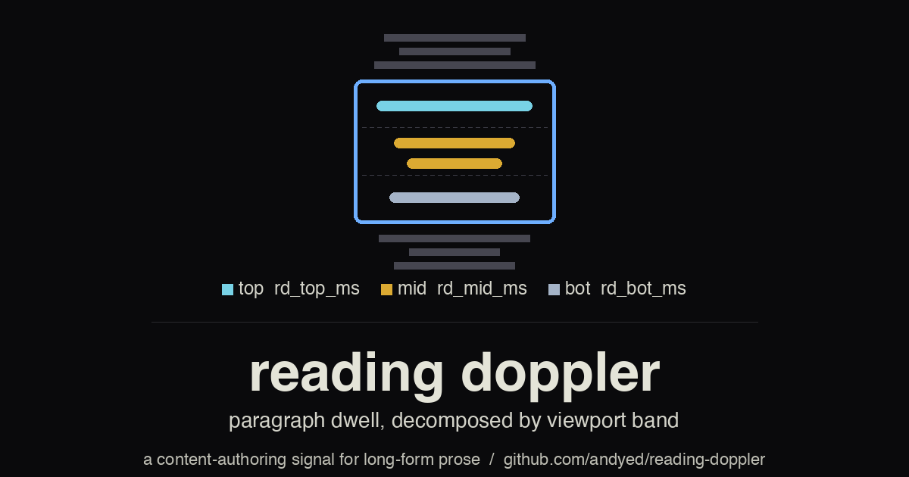

# ReadingDoppler



Paragraph-level reading tracker with viewport-band decomposition. Measures how long each paragraph sits in the top, middle, or bottom third of the viewport — a Doppler-like signature of attention as the reader scrolls.

Ships as a standalone JS library plus a PostHog adapter. No bundler required.

## Install

```bash
npm install reading-doppler
```

Or drop the IIFE build into any page:

```html
<script src="dist/reading-doppler.js"></script>
<script>
  const rd = new window.ReadingDopplerLib.ReadingDoppler({
    onFlush(paragraphs, meta) {
      console.log(meta.flush_number, paragraphs);
    }
  });
  rd.observe(document.querySelector('.prose'));
  window.addEventListener('beforeunload', () => rd.destroy());
</script>
```

ESM:

```js
import { ReadingDoppler, createPostHogAdapter } from 'reading-doppler';

const rd = new ReadingDoppler({
  onFlush: createPostHogAdapter(window.posthog).onFlush,
});
rd.observe(document.querySelector('article'));
```

## What it emits

Each paragraph flushes with:

| Field | Meaning |
|---|---|
| `id` | Stable paragraph ID (`data-rd-id`, or position + first 4 words) |
| `words`, `expected_ms` | Word count + expected dwell at 238 WPM (Brysbaert 2019) |
| `visible_ms`, `absorption` | `visible_ms / expected_ms` (v0.1 contract, unchanged) |
| `rd_top_ms` | Cumulative ms with paragraph center in top third of viewport |
| `rd_mid_ms` | …middle third |
| `rd_bot_ms` | …bottom third |
| `rd_any_ms` | Any viewport intersection (tall-paragraph safe) |
| `paragraph_index`, `paragraph_position_frac` | DOM-order index and fraction of total |

Summary (emitted on `destroy`) additionally carries:

- `rd_viewport_band_basis_px` — live `window.innerHeight` at summary capture
- `rd_viewport_h` — `innerHeight` recorded at construction time
- `rd_viewport_band_schema` — `reading-doppler-vpbands-v1`

If the two basis values differ, the viewport resized mid-session; downstream analyses wanting basis-stable bands should filter on sessions where they match.

## The Doppler motif

As a reader scrolls, each paragraph shifts through the viewport's top/mid/bot thirds. Cumulative ms per band is the signature of how the eye dwelled relative to the motion — high `rd_top_ms` is "reading"; high `rd_bot_ms` is "scrolling past."

The band math is a verbatim port of [approach-retreat](https://github.com/andyed/approach-retreat)'s `computeViewportBandsPure`, which in turn mirrors the Python reference `viewport_ms_for_trial` used in the AdSERP eye-tracking calibration. JS↔Python parity is enforced by `scripts/test_viewport_bands_parity.{js,py}` — all 24 fields (6 synthetic paragraphs × 4 bands) match Δ=0.

## Raw ms only — no scoring baked in

The library does not score, weight, or normalize bands against `expected_ms`. That posture is deliberate:

- The discriminative coefficient across bands is **rank-dependent** in the AdSERP corpus (`vt_top = +2.02` at P0, dropping to +0.21 by P5, CI crossing 0). Whether the same gradient holds in reading content is an empirical question, not an assumption.
- Different corpora (reference docs vs essays vs recipes) may want different weightings.
- The `absorption` field from v0.1 is retained, but no band-weighted absorption is synthesized.

Calibration posture and pending empirical work are documented in [`docs/validation/viewport-bands.md`](docs/validation/viewport-bands.md).

## Family

Part of a trio of behavioral-measurement libraries:

- [**approach-retreat**](https://github.com/andyed/approach-retreat) — cursor dynamics on search results (the original home of `computeViewportBandsPure`).
- [**clicksense**](https://github.com/andyed/clicksense) — motor behavior around clicks, click confidence.
- **reading-doppler** — paragraph dwell decomposed by viewport band.

Same palette, same 8:1 contrast commitment, same "brand glyph literally diagrams the behavioral model" convention.

## Development

```bash
node build.js             # rebuild dist/reading-doppler.js (IIFE)
npm run test:parity       # JS + Python parity check on band math
python3 scripts/brand.py  # regenerate brand assets
npx serve test            # visual test page with debug panel
```

No bundler, no TypeScript, no test runner. The build is a 40-line string-munger; the parity test is the release gate.

## License

MIT.
